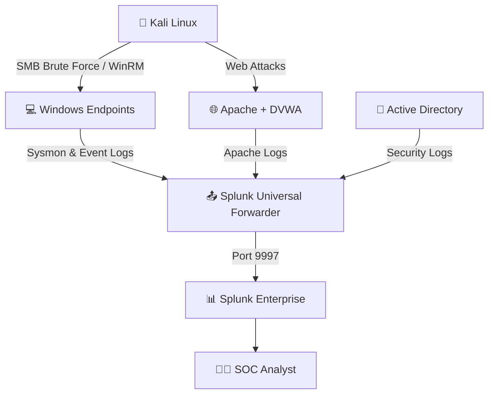

<div align="center">

# 🛡️ Mini SOC — Active Directory Home Lab, Incident Response & Web Attack Detection

**An end-to-end Security Operations Center lab for log collection, cyber kill chain simulation, incident investigation, and web attack detection.**

[]()
[]()
[]()
[]()
[]()

</div>

---

# 📄 Project Documentation

The complete documentation for this project is available in the **docs/** directory.

```text
docs/
├── Project_1.pdf
└── Project_2.pdf
```

- 📘 **Project 1 – Active Directory & SIEM Infrastructure**
  - [View PDF](docs/Project_1.pdf)

- 📗 **Project 2 – Incident Response & Web Attack Detection**
  - [View PDF](docs/Project_2.pdf)

---

# 📑 Table of Contents

- [Overview](#-overview)
- [Project Documentation](#-project-documentation)
- [Lab Environment & Network](#-lab-environment--network)
- [Project Architecture](#-project-architecture)
- [Security Components](#-security-components)
- [Log Sources & Indexes](#-log-sources--indexes)
- [Cyber Kill Chain Simulation](#-cyber-kill-chain-simulation)
- [Incident Investigation](#-incident-investigation)
- [Web Attack Detection](#-web-attack-detection)
- [Contributors](#-contributors)

---

# 🧭 Overview

This repository documents a combined graduation project under the **Digital Egypt Pioneers Initiative (DEPI)** for the **Information Security Analyst** track.

The project simulates a complete Security Operations Center (SOC) environment by combining infrastructure deployment, offensive security, and defensive incident response.

The workflow includes:

1. **Infrastructure & Telemetry**
   - Deploying an Active Directory domain inside VirtualBox.
   - Integrating Windows systems with Splunk Enterprise for centralized logging.

2. **Attack Simulation**
   - Executing a complete Cyber Kill Chain against Windows targets using Kali Linux.

3. **Incident Investigation**
   - Reconstructing the attack timeline through Splunk using Sysmon and Windows Event Logs.

4. **Web Attack Detection**
   - Detecting OWASP Top 10 attacks against DVWA using Apache access logs.

---

# 🌐 Lab Environment & Network

| Node | Role | IP Address |
|------|------|------------|
| Splunk Server | Ubuntu Server (SIEM) | `192.168.100.10` |
| Active Directory | Windows Server 2022 Domain Controller | `192.168.100.7` |
| Windows 11 | Endpoint | `192.168.100.100` |
| Windows 10 | Endpoint | `192.168.1.10` |
| Kali Linux | Attacker | `192.168.100.250` / `192.168.1.9` |

---

# 🏗️ Project Architecture



---

# 🔐 Security Components

<details>
<summary><b>📊 Splunk Enterprise</b></summary>

Central SIEM deployed on Ubuntu Server. Collects and correlates logs from Windows endpoints, Active Directory, and Apache.

</details>

<details>
<summary><b>📤 Splunk Universal Forwarder</b></summary>

Installed on Windows systems to securely forward logs to Splunk over port **9997**.

</details>

<details>
<summary><b>🧩 Sysmon</b></summary>

Configured with a custom **sysmonconfig.xml** to capture process creation, network connections, registry changes, and file events.

</details>

<details>
<summary><b>🏢 Active Directory</b></summary>

Windows Server 2022 configured with the **mydfir.local** domain, Organizational Units, users, and Group Policies.

</details>

<details>
<summary><b>🌐 DVWA</b></summary>

Used as the intentionally vulnerable web application for SQLi, XSS, File Upload, LFI, and Command Injection testing.

</details>

---

# 📋 Log Sources & Indexes

| Source | Log Type | Splunk Index | Examples |
|---------|----------|--------------|----------|
| Windows Security | Event Logs | `endpoint`, `windows10` | 4624, 4625, 4720 |
| Sysmon | Operational Logs | `endpoint`, `windows10` | Event ID 1, 3, 11 |
| Apache | Access Logs | `access-too_small` | SQLi, XSS, Brute Force, LFI |

---

# ⚔️ Cyber Kill Chain Simulation

1. Reconnaissance using **Nmap**
2. Weaponization using **msfvenom**
3. Delivery using **Python HTTP Server**
4. Exploitation via **CrackMapExec** and **Evil-WinRM**
5. Persistence using **Scheduled Tasks** and a hidden administrator account
6. Command & Control with **Metasploit multi/handler**
7. Credential Dumping using **Mimikatz**
8. Defense Evasion by clearing Windows event logs

---

# 🕵️ Incident Investigation

The attack timeline was reconstructed using Splunk SPL queries.

Highlights include:

- Detection of **1,913 failed logon attempts (4625)**.
- Successful authentication following brute force.
- WinRM spawning **PowerShell**.
- Discovery commands (`whoami`, `ipconfig`, `netstat`).
- Scheduled task creation.
- Unauthorized local administrator account creation.
- Mimikatz download and execution.
- SCP exfiltration of dumped credentials.

---

# 🕸️ Web Attack Detection

Detection rules were created for DVWA attacks, including:

- SQL Injection
- Cross-Site Scripting (XSS)
- Local File Inclusion (LFI)
- Path Traversal
- Malicious File Upload
- Brute Force

> **Note:** POST body attacks (such as Stored XSS and Command Injection) are not fully visible in Apache access logs. Full HTTP body capture or WAF logging is required for complete detection.

---

# 👥 Contributors

**Digital Egypt Pioneers Initiative (DEPI)**

**Track:** Information Security Analyst (ONL4_ISS6_S3)

**Instructor:** Eng. Amr Adel

### Team 1 — Active Directory & SIEM

- Ahmed Mohamed Gamal
- Ahmed Sobhy Abdulfattah
- Mohamed Sadeq Mohamed Mosleh
- Sama Ahmed Rasly

### Team 2 — Offensive Security & Incident Response

- Ahmed Elsayed Albanna
- Mostafa Rabee Mostafa Elshall

---

<div align="center">

⭐ **If you found this project useful, consider giving it a star!**

</div>
